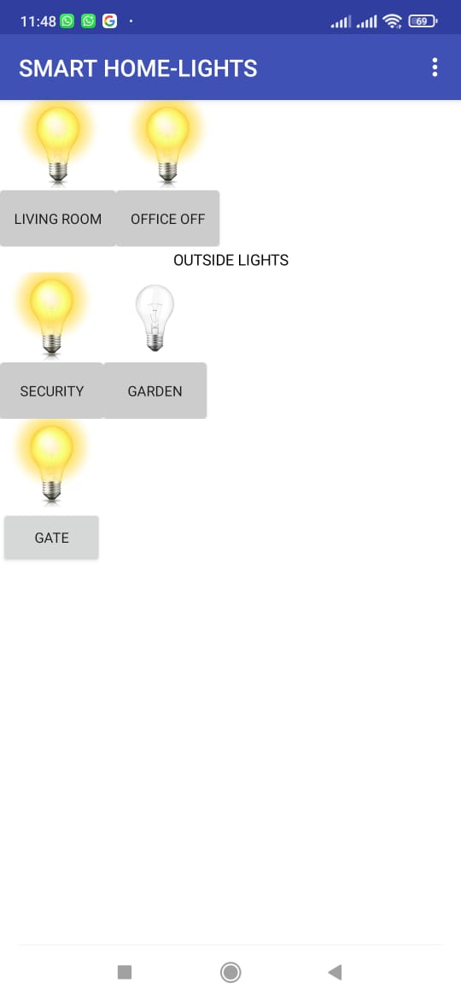
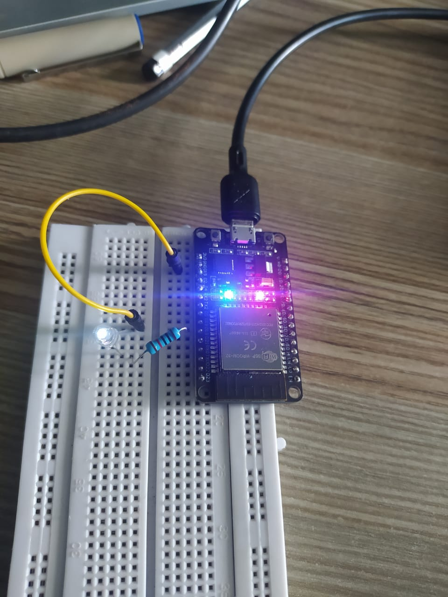
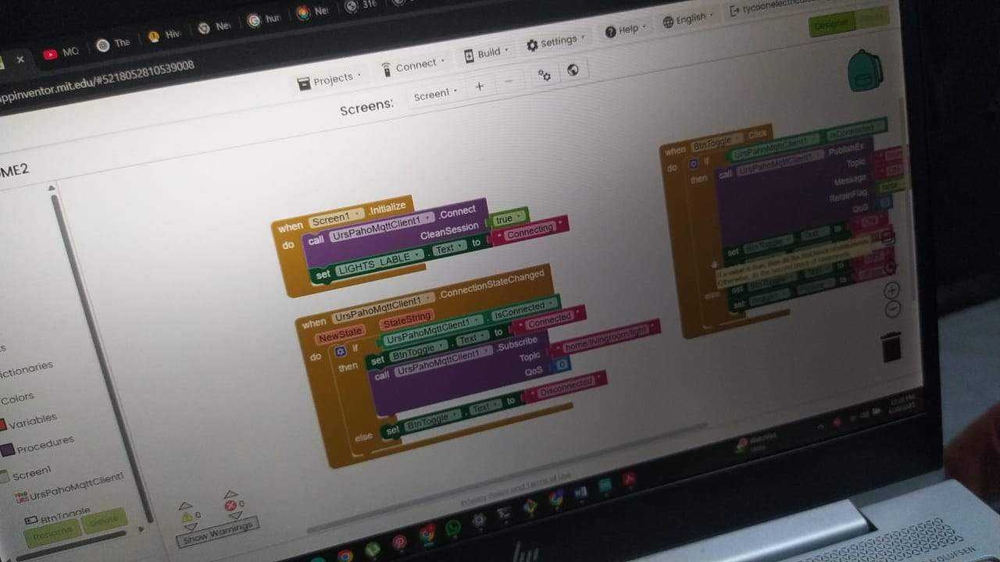

# Smart Home Automation using ESP32 and Secure MQTT

This project demonstrates a secure, real-time home automation system built using an ESP32 microcontroller and a mobile application developed in MIT App Inventor. Communication between the app and the ESP32 is handled over a secure SSL-encrypted MQTT connection hosted on HiveMQ Cloud.

## Project Goals

- Enable control of smart devices over the internet using secure protocols.
- Demonstrate SSL-based MQTT communication for IoT safety.
- Provide a scalable architecture for expanding to more devices.

## Components

- ESP32 development board
- HiveMQ Cloud MQTT broker
- MIT App Inventor with UrsPahoMqttClient extension
- Android smartphone
- Wi-Fi network

## Features

- Toggle LED on the ESP32 board via the app.
- Display live connection status.
- Secure communication using SSL (Port 8883).
- Structured and documented for scalability and GitHub collaboration.

## MQTT Configuration

- Broker:*****
- Port: *** (SSL)
- Username: ***
- Password: ***
- Topic: home/livingroom/light

## ESP32 SSL Configuration

- SSL enabled using Let's Encrypt root certificate.
- Time synchronization via NTP (required for SSL).
- PubSubClient library used for MQTT.
- WiFiClientSecure for TLS layer.

## Mobile App (MIT App Inventor)

- Uses UrsPahoMqttClient extension.
- Configured with SSL protocol.
- Broker details, credentials, and topic provided via component properties.
- UI includes:
  - MQTT connection status label
  - LED toggle switch

